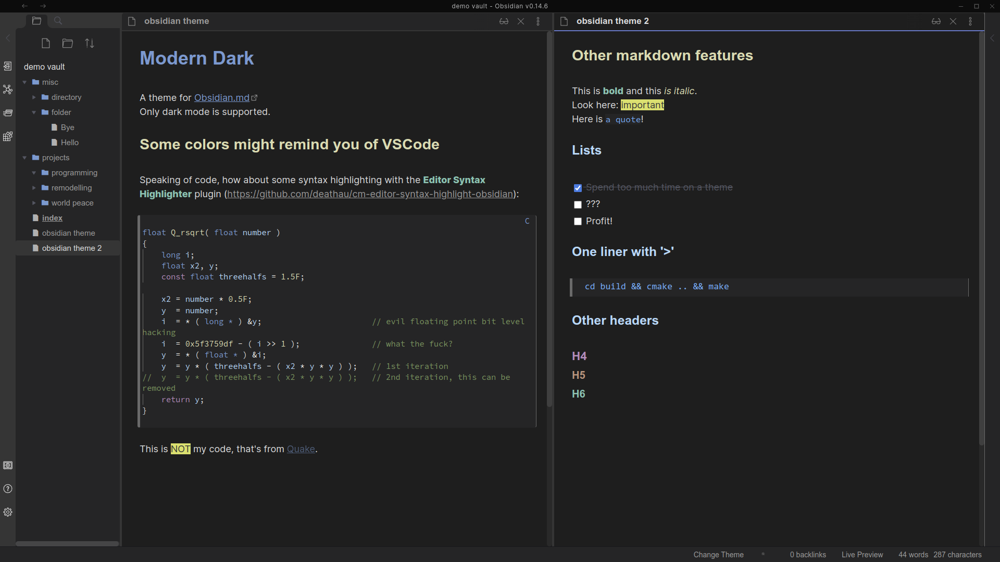

# Obsidian Theme Modern Dark

Theme for the markdown editor [Obsidian.md](https://obsidian.md).
Intended to roughly match the style of Adwaita and VSCode in dark mode.

Only dark mode is supported!

## Installation

1. Download obsidian.css
2. Place it into your obsidian vaults `.obsidian/themes` folder (create it if it doesn't exist).
3. Restart Obsidian and select the theme.

